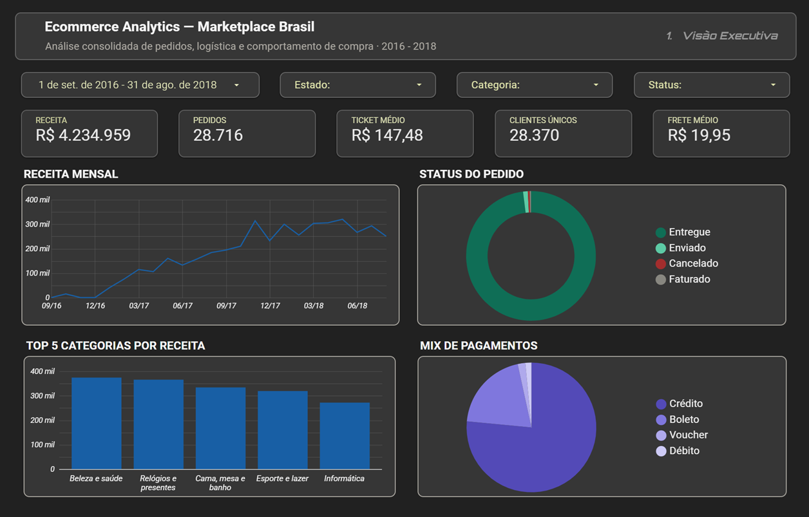

# Ecommerce Analytics — Marketplace Brasil

Dashboard analítico construído no Looker Studio sobre dados de um marketplace brasileiro de e-commerce (2016–2018), explorando performance comercial, distribuição geográfica, operação logística e comportamento de compra.

**Projeto desenvolvido para portfólio**, com foco em demonstrar competências em tratamento de dados, modelagem analítica e construção de dashboards profissionais.

🔗 **Dashboard interativo**: [Ver no Looker Studio →](https://datastudio.google.com/s/seoZzmUFPLg)
📊 **Versão estática (PDF)**: [Baixar o PDF do dashboard](docs/Ecommerce_Analytics_—_Marketplace_Brasil.pdf)

---

## 📋 Índice

1. [Resumo executivo](#-resumo-executivo)
2. [Contexto e fonte de dados](#-contexto-e-fonte-de-dados)
3. [Tratamento de dados](#-tratamento-de-dados)
4. [Modelagem analítica](#-modelagem-analítica)
5. [Estrutura do dashboard](#-estrutura-do-dashboard)
6. [Principais insights](#-principais-insights)
7. [Decisões de design](#-decisões-de-design)
8. [Limitações e pontos de atenção](#-limitações-e-pontos-de-atenção)
9. [Perguntas e respostas para entrevista](#-perguntas-e-respostas-para-entrevista)
10. [Como reproduzir](#-como-reproduzir)
11. [Stack utilizada](#-stack-utilizada)

---

## 🎯 Resumo executivo

O dashboard analisa **30.000 itens de pedido** (28.716 pedidos únicos) movimentando **R$ 4,23 milhões** em receita entre setembro de 2016 e agosto de 2018, em um marketplace nacional com operação em 27 estados brasileiros.

A análise revela um negócio com **trajetória de crescimento acelerada** (receita mensal saindo de R$ 5 mil em set/2016 para a casa de R$ 280 mil em ago/2018), mas com **três gargalos estratégicos significativos**:

1. **Concentração geográfica crítica**: 63,7% da receita vem do Sudeste, com São Paulo respondendo sozinho por 36,7% — concentração de risco e oportunidade de expansão regional
2. **Desigualdade logística regional**: tempo médio de entrega varia de 8 dias em SP a mais de 23 dias em estados do Norte
3. **Baixíssima recompra**: a base mostra praticamente 1 pedido por cliente, indicando ausência de estratégia de retenção

O dashboard está organizado em 4 páginas temáticas (Visão Executiva, Geografia, Logística, Comportamento) e permite filtragem por período, estado, categoria e status do pedido.

---

## 📚 Contexto e fonte de dados

### Sobre os dados

A base utilizada é uma versão denormalizada de dados públicos de um marketplace brasileiro de e-commerce. O arquivo original (`ecommerce_orders_denormalized.csv`) contém 30.000 linhas e 43 colunas, onde cada linha representa **um item de pedido** (granularidade item × pedido).

### Dicionário de campos principais

| Categoria | Campos representativos |
|---|---|
| Pedido | `order_id`, `order_item_id`, `order_status`, `order_purchase_timestamp` |
| Cliente | `customer_unique_id`, `customer_state`, `customer_city` |
| Vendedor | `seller_id`, `seller_state`, `seller_city` |
| Produto | `product_id`, `product_category_name_english`, dimensões físicas |
| Financeiro | `price`, `freight_value`, `item_total_value`, `payment_type_main`, `payment_installments_total` |
| Logística | `delivery_days`, `estimated_delivery_days`, `delivery_delay_days`, `is_late_delivery` |

### Período coberto

- **Início**: 04/09/2016
- **Fim**: 29/08/2018
- **Observação**: 2016 e 2018 são anos parciais (4 meses em 2016, 8 meses em 2018). Apenas 2017 está completo.

---

## 🛠️ Tratamento de dados

### Achado importante: corrupção CSV → XLSX

Durante o setup inicial do projeto, identifiquei um problema clássico de conversão de arquivos: o CSV original estava íntegro, mas ao ser aberto no Excel, **valores decimais foram interpretados como notação científica ou datas**, gerando corrupção em colunas monetárias.

**Exemplo concreto da mesma linha:**

| Campo | CSV original (correto) | XLSX corrompido |
|---|---|---|
| `price` | 36,49 | 36,49 |
| `freight_value` | 17,24 | 17,24 |
| `item_total_value` | **53,73** | **5,373 × 10¹⁶** |

**Causa raiz**: o Excel, ao abrir CSVs em ambiente com locale inconsistente (PT-BR + EN-US), pode interpretar separadores decimais como gatilhos para notação científica. Cerca de 9% das linhas (~2.811) sofreram corrupção em pelo menos uma coluna monetária.

**Solução implementada:**

1. Trabalhei sempre a partir do CSV original (fonte limpa)
2. Carreguei diretamente no Google Sheets configurando o locale como Brasil antes de qualquer leitura
3. Conectei a fonte ao Looker Studio via Google Sheets, não via Excel
4. Documentei o problema para que análises futuras evitem o mesmo erro

**Lição aprendida**: nunca tratar conversão de formato como operação inócua. Em pipelines de produção, isso justifica validações automáticas de tipos antes e depois de cada transformação.

### Tratamento de valores nulos

Os nulos remanescentes na base limpa são **legítimos e contextuais**:

| Campo | Nulos | Causa |
|---|---|---|
| `order_delivered_customer_date` | 675 | Pedidos não-entregues (cancelados, processando, etc.) |
| `delivery_days`, `delivery_delay_days` | 675 | Derivados da data de entrega |
| `product_category_name` | 409 | Produtos sem categoria cadastrada |
| `order_delivered_carrier_date` | 299 | Pedidos ainda não despachados |

**Decisão**: não removi essas linhas. Filtros locais foram aplicados em gráficos específicos quando necessário (ex: análise de tempo de entrega filtra para `order_status = "delivered"`).

---

## 📐 Modelagem analítica

### Campos calculados criados no Looker Studio

#### Métricas financeiras

```sql
-- Receita Total
SUM(item_total_value)

-- Ticket Médio
SUM(item_total_value) / COUNT_DISTINCT(order_id)
```

#### Métricas logísticas

```sql
-- % Pedidos Atrasados
SUM(CASE WHEN delivery_delay_days > 0 THEN 1 ELSE 0 END) / COUNT(order_id)

-- Atraso médio (quando atrasa)
AVG(CASE WHEN delivery_delay_days > 0 THEN delivery_delay_days END)

-- Antecipação média
estimated_delivery_days - delivery_days
```

#### Dimensões agrupadas

```sql
-- Região do Brasil
CASE
  WHEN customer_state IN ("SP","RJ","MG","ES") THEN "Sudeste"
  WHEN customer_state IN ("RS","SC","PR") THEN "Sul"
  WHEN customer_state IN ("BA","PE","CE","MA","PB","RN","AL","SE","PI") THEN "Nordeste"
  WHEN customer_state IN ("GO","MT","MS","DF") THEN "Centro-Oeste"
  WHEN customer_state IN ("AM","PA","RO","AC","RR","AP","TO") THEN "Norte"
  ELSE "Outros"
END

-- Faixa de tempo de entrega (prefixo numérico força ordenação)
CASE
  WHEN delivery_days < 4 THEN "1. 0-3 dias"
  WHEN delivery_days < 8 THEN "2. 4-7 dias"
  WHEN delivery_days < 11 THEN "3. 8-10 dias"
  -- ... demais faixas
END

-- Faixa de parcelas
CASE
  WHEN payment_installments_total = 1 THEN "1. À vista"
  WHEN payment_installments_total <= 3 THEN "2. 2-3x"
  -- ... demais faixas
END
```

#### Traduções de dimensões

Campos originais estavam em inglês (`payment_type_main`, `product_category_name_english`, `order_status`). Criei campos calculados com `CASE WHEN` para tradução, permitindo manter a fonte original intocada e exibir os rótulos em português no dashboard.

### Desafios técnicos resolvidos

**Booleanos como string no Looker Studio**: o campo `is_late_delivery` veio do CSV como string ("True"/"False"), e tentativas de comparação direta no Looker retornavam erro `Cannot cast from STRING to BOOL`. A solução foi **substituir comparações booleanas por comparações numéricas** usando o campo `delivery_delay_days > 0`, evitando o casting problemático.

**Ordenação de faixas categóricas**: o Looker ordena dimensões textuais alfabeticamente por padrão. Para faixas de tempo e parcelas, prefixei os labels com numeração (`"1. À vista"`, `"2. 2-3x"`) para forçar a ordem analítica correta.

---

## 🗂️ Estrutura do dashboard

### Página 1 — Visão Executiva

KPIs gerais e visão de alto nível do negócio.

**Componentes:**
- 5 scorecards: Receita, Pedidos, Ticket Médio, Clientes Únicos, Frete Médio
- Receita mensal (linha temporal)
- Status do pedido (donut)
- Top 5 categorias por receita (colunas)
- Mix de pagamentos (pizza)

### Página 2 — Geografia

Análise de distribuição regional e concentração geográfica.

**Componentes:**
- 4 scorecards: Estados ativos, Cidades atendidas, % Sudeste, % São Paulo
- Treemap de receita por região
- Tabela ranqueada de 27 estados com pedidos, receita, ticket médio e tempo de entrega
- Donut intra × interestadual

### Página 3 — Logística

Performance operacional e qualidade de entrega.

**Componentes:**
- 4 scorecards: Tempo médio, Prazo prometido, % Atrasados, Atraso médio quando atrasa
- Histograma de distribuição de tempo de entrega
- Top 15 estados por tempo médio (formatação condicional)
- Dispersão frete × dias de entrega (com linha de tendência)

### Página 4 — Comportamento

Padrões de compra, pagamento e categorização.

**Componentes:**
- 4 scorecards: Parcelas média, % À vista, Taxa de recompra, Pico mensal
- Distribuição de parcelas (colunas)
- Ticket médio por meio de pagamento (barras horizontais)
- Heatmap categoria × meio de pagamento (tabela dinâmica com formatação condicional)

---

## 💡 Principais insights

### 1. Concentração regional extrema

São Paulo sozinho responde por **36,7% da receita total** e o Sudeste por 63,7%. Isso configura simultaneamente uma vulnerabilidade (dependência de um polo geográfico) e uma oportunidade (mercado nacional inexplorado).

### 2. Subpromessa estratégica como diferencial competitivo

O **prazo prometido** médio (23,4 dias) é quase o **dobro do tempo real de entrega** (12 dias). Isso explica por que apenas 6,5% dos pedidos atrasam: a empresa joga conservador na comunicação do prazo para garantir alta taxa de pontualidade percebida. É um padrão deliberado, não um acaso.

### 3. Desigualdade logística por região

Tempo médio de entrega varia drasticamente: **8 dias em SP/MG** contra **18-23 dias em estados do Norte e Nordeste**. O custo do frete não compensa essa diferença (a linha de tendência do scatter mostra que frete maior não compra tempo de entrega significativamente menor) — o gargalo é estrutural, não financeiro.

### 4. Quando atrasa, atrasa muito

Apesar de só 6,5% dos pedidos atrasarem, **o atraso médio é de 10,7 dias**. Para o cliente que dá azar, isso significa esperar cerca de 33 dias (23 prometidos + 10 de atraso). Esse é o tipo de evento que gera reclamação, devolução e churn.

### 5. Concentração brutal em cartão de crédito

Mais de 70% dos pedidos são pagos com cartão de crédito. Isso configura risco operacional (dependência de adquirentes específicas) e também sinaliza ausência de PIX — coerente com o período da base (2016–2018), anterior ao lançamento do PIX no Brasil.

### 6. Padrão conservador de parcelamento

Quase **50% dos pedidos são pagos à vista**, com a maioria dos parcelamentos em até 6x. Isso conversa com o ticket médio relativamente baixo (R$ 147) e sugere público que evita endividamento longo.

### 7. Recompra anêmica — o insight crítico

A base mostra **28.370 clientes únicos para 28.716 pedidos**, com taxa de recompra calculada em ~1,2%. **Praticamente cada cliente compra apenas uma vez.** Esse é o achado mais estratégico do dashboard, indicando que o esforço de aquisição não se converte em LTV, e que há ausência clara de estratégia de retenção (programa de fidelidade, email marketing, cupom de recompra, categoria-âncora).

---

## 🎨 Decisões de design

### Paleta de cores

Optei por uma paleta funcional com significado semântico consistente em todas as páginas:

| Cor | Uso | Significado |
|---|---|---|
| Verde (`#0F6E56`, `#1D9E75`) | Status positivos | Entregue, no prazo, sucesso |
| Vermelho (`#A32D2D`, `#D85A30`) | Status negativos | Cancelado, atraso, problema |
| Azul (`#185FA5`, `#378ADD`) | Métricas neutras | Receita, volume, contagens |
| Roxo (`#534AB7`, `#7F77DD`) | Categorização neutra | Pagamentos, parcelas |
| Âmbar (`#BA7517`) | Distribuições neutras | Histograma de tempo |
| Cinza (`#888780`) | Ruído / outros | "Não definido", neutros |

**Princípio**: máximo de 2–3 famílias de cor por página. Dashboards "arco-íris" geralmente escondem falta de hierarquia analítica.

### Tema escuro

Escolhi tema escuro pelo dashboard ter muitos gráficos com áreas preenchidas — o fundo escuro reduz fadiga visual e faz os scorecards e gráficos coloridos "respirarem". Também tem aspecto profissional condizente com ferramentas de BI modernas.

### Hierarquia visual

Em cada página:
1. **Cabeçalho** com título e identificação da página
2. **Filtros globais** logo abaixo
3. **Faixa de scorecards** com KPIs principais
4. **Grid de gráficos** organizando do mais geral (esquerda) ao mais específico (direita)

### Tabela dinâmica como heatmap

O Looker Studio não tem componente nativo de heatmap, mas é possível obter o efeito visual com **tabela dinâmica + formatação condicional por gradiente**. Essa solução está aplicada no cruzamento Categoria × Pagamento na Página 4.

---

## ⚠️ Limitações e pontos de atenção

### Limitações da base de dados

- **Período parcial**: 2016 cobre apenas 4 meses (set–dez), 2018 cobre 8 meses (jan–ago). Comparações ano a ano envolvendo esses períodos podem ser enganosas.
- **Ausência do PIX**: a base é anterior ao lançamento do PIX (nov/2020). A análise de mix de pagamentos não reflete a realidade atual do e-commerce brasileiro.
- **Categorias originalmente em inglês**: a base usa nomenclatura em inglês para categorias de produto. Apliquei tradução manual via `CASE WHEN`, mas categorias muito específicas podem ter tradução aproximada.

### Limitações analíticas conhecidas

- **Taxa de recompra**: usei a fórmula `(pedidos - clientes únicos) / pedidos` como proxy de recompra. Métricas mais sofisticadas (cohort analysis, frequência por janela temporal) exigiriam ferramenta adicional além do Looker Studio.
- **Outliers no scatter de frete × entrega**: optei por manter outliers visíveis em vez de filtrar, porque eles representam parte do diagnóstico de cauda longa logística. Isso comprime a nuvem principal de pontos.
- **Comparações temporais nos scorecards da Página 1**: as comparações automáticas de período no Looker geram percentuais inflados (~328%) devido aos períodos parciais. Estou ciente da limitação e isso seria refinado em uma versão futura com filtros temporais customizados.

### Granularidade

A base tem granularidade **item × pedido** (cada linha = um item dentro de um pedido). Para análises de pedido, é necessário usar `COUNT_DISTINCT(order_id)`. Para análises de cliente, `COUNT_DISTINCT(customer_unique_id)`. Confundir granularidade é uma das principais armadilhas neste tipo de base.

---

## 🎤 Perguntas e respostas para entrevista

### Sobre tratamento de dados

**P: Por que você escolheu trabalhar com o CSV em vez do Excel?**

R: Identifiquei que a conversão CSV → XLSX corrompia valores monetários em cerca de 9% das linhas — o Excel interpretava decimais como notação científica. O CSV original estava íntegro, então trabalhar diretamente com ele preservou a qualidade dos dados. Em ambiente de produção, isso reforça o princípio de não tratar conversões de formato como operações neutras.

**P: Como você lidou com valores nulos?**

R: Os nulos remanescentes eram contextuais (pedidos não-entregues não têm data de entrega, por exemplo). Em vez de remover, mantive e apliquei filtros locais nos gráficos quando necessário — por exemplo, análises de tempo de entrega filtram para `order_status = "delivered"`. Isso preserva a base íntegra e permite análises distintas sobre o conjunto completo.

### Sobre modelagem

**P: Por que criar campos calculados em vez de tratar tudo no Sheets?**

R: Campos calculados no Looker Studio são **centralizados na fonte de dados** — uma alteração propaga para todos os gráficos. Se eu tratasse no Sheets, qualquer ajuste exigiria refazer cálculos manualmente. Além disso, mantenho a separação entre **dado bruto** (Sheets) e **dado modelado** (Looker), o que é um princípio de engenharia de dados.

**P: Como você calcula taxa de recompra?**

R: Usei a fórmula `(pedidos - clientes únicos) / pedidos`. Há outras definições igualmente válidas — por exemplo, "% de clientes que compraram mais de uma vez". Documentei no README qual definição usei, porque cada uma responde a uma pergunta de negócio diferente. Em entrevista, perguntaria ao time qual definição é mais útil para a operação.

### Sobre insights

**P: Qual o insight mais importante deste dashboard?**

R: A baixíssima recompra. A base tem praticamente 1 pedido por cliente único, indicando que o esforço de aquisição não se converte em LTV. Isso vale mais que qualquer otimização operacional — é um problema estratégico. Faria três perguntas ao time de negócio: (1) existe programa de fidelidade ativo, (2) qual o investimento atual em retenção via email marketing, (3) qual a categoria-âncora que poderia gerar repeat purchase.

**P: Se o prazo prometido é o dobro do realizado, isso é bom ou ruim?**

R: Depende do contexto. É bom porque garante alta taxa de pontualidade percebida (6,5% de atraso). É ruim porque pode estar afastando clientes na conversão (concorrente que promete 12 dias parece melhor que um que promete 23). Faria um teste A/B com prazos mais próximos do real para medir impacto em conversão vs. impacto em reclamação.

**P: O que você faria com 30 dias e acesso ao time?**

R: 
1. Validaria a taxa de recompra com a base atualizada (essa base é de 2018)
2. Cruzaria atraso × NPS × recompra para entender se atraso reduz LTV
3. Criaria segmentação RFM (Recency, Frequency, Monetary) dos clientes
4. Recomendaria experimento em 2–3 estados do Nordeste para validar hipótese de "expansão regional como vetor de crescimento"

### Sobre o dashboard em si

**P: Por que dividir em 4 páginas em vez de uma única?**

R: Cada página responde a uma pergunta de negócio diferente: "como o negócio está performando?", "onde estão meus clientes?", "estou entregando bem?", "como compram?". Concentrar tudo em uma página vira ruído visual; separar por contexto facilita uso por diferentes stakeholders (CEO olha página 1, ops olha página 3).

**P: Por que escolheu treemap para receita por região?**

R: O treemap comunica hierarquia e proporção em um único componente compacto, sem precisar de eixos. Para apenas 5 regiões com distribuição muito desigual, é mais legível que barras ou pizza — Sudeste domina visualmente e a leitura é imediata.

---

## 🔧 Como reproduzir

### Pré-requisitos

- Conta Google
- Acesso ao Google Sheets e Looker Studio

### Passos

1. **Baixe a base de dados**: [ecommerce_orders_denormalized.csv](data/ecommerce_orders_denormalized.csv)
2. **No Google Drive**, faça upload do CSV e abra com Google Planilhas
3. **Configure o locale**: Arquivo → Configurações → Brasil
4. **Acesse o [Looker Studio](https://lookerstudio.google.com)** e crie um novo relatório
5. **Conecte a fonte de dados** apontando para a planilha do Sheets
6. **Configure os tipos de campo** (datas, geográficos, moeda) — ver detalhamento na seção "Modelagem analítica"
7. **Crie os campos calculados** listados na seção de modelagem
8. **Construa as 4 páginas** seguindo a estrutura descrita

Os passos detalhados de cada gráfico podem ser inferidos a partir das fórmulas e da estrutura aqui documentadas.

---

## 🧰 Stack utilizada

- **Google Sheets**: armazenamento da base e ajustes de locale
- **Looker Studio**: construção do dashboard, modelagem de campos calculados, formatação condicional
- **Python (pandas)**: validação inicial da base e identificação da corrupção CSV → XLSX
- **GitHub**: versionamento e portfólio público

---

## 👤 Sobre

Projeto desenvolvido por **Luca**, estudante de Engenharia de Software (INFNET, formação prevista para 2029), 
com foco em construir carreira na área de Análise de Dados.

🔗 **LinkedIn**: [linkedin.com/in/luca-neves](https://linkedin.com/in/luca-neves)
🔗 **GitHub**: [github.com/lucaneves1](https://github.com/lucaneves1)

---

## 📄 Licença

Este projeto é de uso educacional. A base de dados utilizada é pública. O código e a documentação podem ser livremente referenciados.
